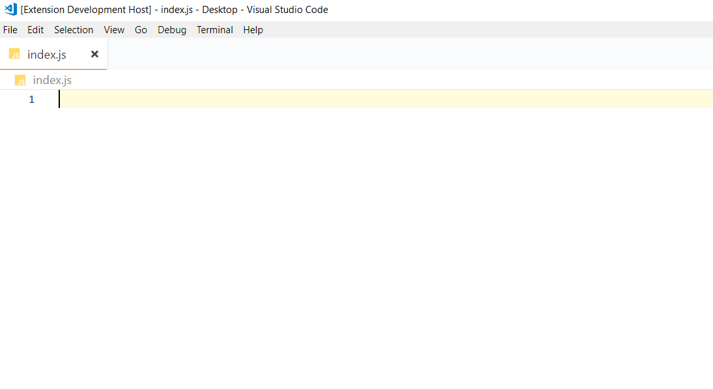

# zp-react-redux-es6-standard

This is a simple colection of snippet for usage with React and Redux using ES6 and standard being using at Zeplyrplace.

## Features

[](https://github.com/standard/standard)

| Command | Description |
| --- | --- |
| `rcc→` | Create a React Component Class |

``` javascript
import React, { Component } from 'react'

export default class $1 extends Component {
  render () { 
    return (
      <div>$2</div>
    )
  }
}

```

| Command | Description |
| --- | --- |
| `rcs→` | Create a React Component Stateless |

``` javascript
import React from 'react'

const $1 = () => {
  return (
    <div>$2</div>
  )
}

export default $1

```

| Command | Description |
| --- | --- |
| `rccp→` | Create a React Component Class with PropTypes |

``` javascript
import React, { Component } from 'react'
import PropTypes from 'prop-types'

class $1 extends Component {
  render () {
    return (
      <div>$3</div>
    )
  }
}

$1.propTypes = {
  $2
}

export default $1


```

| Command | Description |
| --- | --- |
| `rcsp→` | Create a React Component Class with PropTypes |

``` javascript
import React from 'react'
import PropTypes from 'prop-types'

const $1 = props => {
  return (
    <div>$3</div>
  )
}

$1.propTypes = {
  $2
}

export default $1

```

| Command | Description |
| --- | --- |
| `rrcc→` | Create a Redux Container with connect and bindActionCreators |

``` javascript
import { bindActionCreators } from 'redux'
import { connect } from 'react-redux'

const mapStateToProps = (state) => ({ $1: state.$2 })
const mapDispatchToProps = (dispatch) => bindActionCreators($3, dispatch)

export default connect(mapStateToProps, mapDispatchToProps)($4)

```

| Command | Description |
| --- | --- |
| `rrdc→` | Create a Redux Reducer |

``` javascript
export default (state = $1, action) => {
  switch (action.type) {
    case $2:
      $3
    default:
      return state
  }
}

```

| Command | Description |
| --- | --- |
| `raf→` | Create a Redux action function |

``` javascript
export const $1 = '$1'

export const $2 = $3 => ({
  type: $1,
  $3
})

```

| Command | Description |
| --- | --- |
| `rafr→` | Create a Redux action function with return |

``` javascript
export const $1 = $2 => {
  return $3
}

```



> Why?: Many popular extensions utilize superfluous snippets. This is tiny with minimium requirements and the only one with correct Standard JS.

## Utilities

| Command | Description |
| --- | --- |
| `tp→` | this.props |
| `ts→` | this.state |

| Command  | Description |
| --- | --- |
| `pta→`   | PropTypes.array, |
| `ptar→`  | PropTypes.array.isRequired, |
| `ptb→`   | PropTypes.bool, |
| `ptbr→`  | PropTypes.bool.isRequired, |
| `ptf→`   | PropTypes.func, |
| `ptfr→`  | PropTypes.func.isRequired, |
| `ptn→`   | PropTypes.number, |
| `ptnr→`  | PropTypes.number.isRequired, |
| `pto→`   | PropTypes.object., |
| `ptor→`  | PropTypes.object.isRequired, |
| `pts→`   | PropTypes.string, |
| `ptsr→`  | PropTypes.string.isRequired, |
| `ptnd→`  | PropTypes.node, |
| `ptndr→` | PropTypes.node.isRequired, |
| `ptel→`  | PropTypes.element, |
| `ptelr→` | PropTypes.element.isRequired, |
| `pti→`   | PropTypes.instanceOf(ClassName), |
| `ptir→`  | PropTypes.instanceOf(ClassName).isRequired, |
| `pte→`   | PropTypes.oneOf(['News', 'Photos']), |
| `pter→`  | PropTypes.oneOf(['News', 'Photos']).isRequired, |
| `ptet→`  | PropTypes.oneOfType([PropTypes.string, PropTypes.number]), |
| `ptetr→` | PropTypes.oneOfType([PropTypes.string, PropTypes.number]).isRequired, |
| `ptao→`  | PropTypes.arrayOf(PropTypes.number), |
| `ptaor→` | PropTypes.arrayOf(PropTypes.number).isRequired, |
| `ptoo→`  | PropTypes.objectOf(PropTypes.number), |
| `ptoor→` | PropTypes.objectOf(PropTypes.number).isRequired, |
| `ptsh→`  | PropTypes.shape({color: PropTypes.string, fontSize: PropTypes.number}), |
| `ptshr→` | PropTypes.shape({color: PropTypes.string, fontSize: PropTypes.number}).isRequired, |


## Requirements

```
npm install standard --save-dev
npm install prop-types --save
```

## Release Notes

### 0.0.3

New utilities snippets and update Redux action function with return

### 0.0.2

Update logo

### 0.0.1

Initial release of the main snippets usage at Zephyrplace

## References

* [vscode-react-standard](https://github.com/TimonVS/vscode-react-standard/)

***

